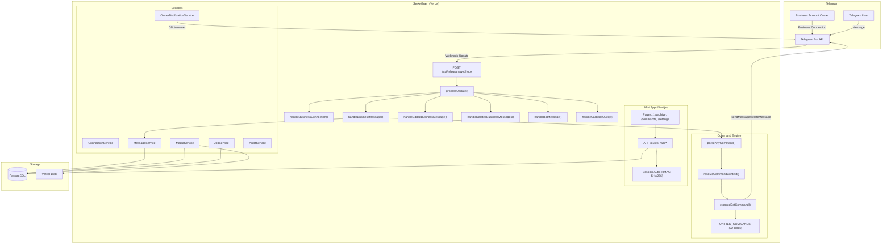

# SerkoGram 2.0 — System Architecture

## Overview

SerkoGram is a **Telegram Automation Chat** platform built on Telegram Bot API 7.2+ Business Connections. It allows Telegram Business account owners to manage their chats through dot-commands (`.help`, `.save`, `.mute`) processed by a webhook-driven pipeline, with a Next.js Mini App for archive browsing, command reference, and settings.

**Tech Stack:** Next.js 15 (App Router) · TypeScript · Prisma ORM · PostgreSQL · Grammy Bot Framework · Vercel (Serverless) · Vercel Blob Storage

---

## System Architecture Diagram



---

## Request Flow

```
Telegram sends webhook POST
  → /api/telegram/webhook (route.ts)
    → Validates X-Telegram-Bot-Api-Secret-Token
    → Parses JSON body as Update
    → processUpdate(update)
      → Idempotency check (ProcessedUpdate table)
      → Route by update type:
        business_connection   → handleBusinessConnection()
        business_message      → handleBusinessMessage()
        edited_business_message → handleEditedBusinessMessage()
        deleted_business_messages → handleDeletedBusinessMessages()
        message               → handleBotMessage()
        callback_query        → handleCallbackQuery()
      → processDueJobs() (background sweep)
      → Mark update as processed
    → Return 200 OK
```

---

## Command Pipeline

```
Raw Message
  → effectiveText = msg.text ?? msg.caption ?? ''
  → parseAnyCommand(effectiveText)
    → Detect prefix (. or /)
    → Extract command name + args
  → resolveCommandContext(msg, connection, owner)
    → ownerTelegramId (BigInt) — NEVER compared with DB ownerId (cuid)
    → businessConnectionId
    → telegramChatId
    → senderTelegramId
    → isOwnerMessage (outgoing check)
    → permissions from BusinessBotRights
  → executeDotCommand(context)
    → Banned command check (.dox, .deanon, .osint)
    → Owner-only check
    → Rate limit check
    → Switch on command name → handler
    → Telegram API call (sendMessage, deleteMessage, etc.)
    → DB persistence (ChatAutomationSettings, ChatWarning, etc.)
    → Return result
```

---

## Database Schema (Key Models)

| Model | Purpose |
|-------|---------|
| `User` | Telegram users (telegramId: BigInt, unique) |
| `Connection` | Business connections (businessConnectionId, userId, rights) |
| `Chat` | Managed chats (connectionId, telegramChatId) |
| `Message` | Archived messages (text, telegramDate, isOutgoing, isEdited, isDeleted) |
| `MessageMedia` | Media attachments (telegramFileId, storageUrl, isEphemeral) |
| `MessageVersion` | Edit history (version number, previous text) |
| `ChatAutomationSettings` | Per-chat automation state (muteEnabled, panicEnabled, warningThreshold) |
| `ChatWarning` | Per-user warning counts within a chat |
| `ScheduledJob` | Durable timer jobs (executeAt, status, payload) |
| `ProcessedUpdate` | Idempotency tracking (updateId, unique) |
| `OwnerNotification` | Private notifications for Mini App inbox |
| `SupportTicket` / `SupportMessage` | Support system |
| `AuditLog` | Security and action audit trail |

---

## Auth Flow (Mini App)

```
Telegram WebApp opens Mini App
  → WebApp.initData sent to /api/auth/telegram
  → Server validates HMAC-SHA256:
    1. Parse initData query string
    2. Extract hash parameter
    3. Build data_check_string (sorted key=value pairs)
    4. secret_key = HMAC-SHA256("WebAppData", BOT_TOKEN)
    5. computed_hash = HMAC-SHA256(secret_key, data_check_string)
    6. Compare computed_hash with received hash
  → If valid: create session, return JWT
  → All API routes use requireAuth() → verify JWT → resolve user
```

---

## Key Design Decisions

1. **Internal ID ≠ Telegram ID**: DB uses `cuid` strings; Telegram uses `BigInt`. Never compared with `===`.
2. **Durable over in-memory**: All production state (mute, panic, warnings, timers) stored in PostgreSQL, not `Map`/`Set`.
3. **Silent archive**: No confirmation messages in managed chats. Owner notifications only via private DM or Mini App.
4. **Idempotency-last**: `ProcessedUpdate` created AFTER successful processing, not before — preventing lost events.
5. **Single source of truth**: `UNIFIED_COMMANDS` in `registry.ts` is the only command definition source.
6. **Privacy boundary**: `.dox`, `.deanon`, `.osint` are permanently banned at registry and executor levels.
